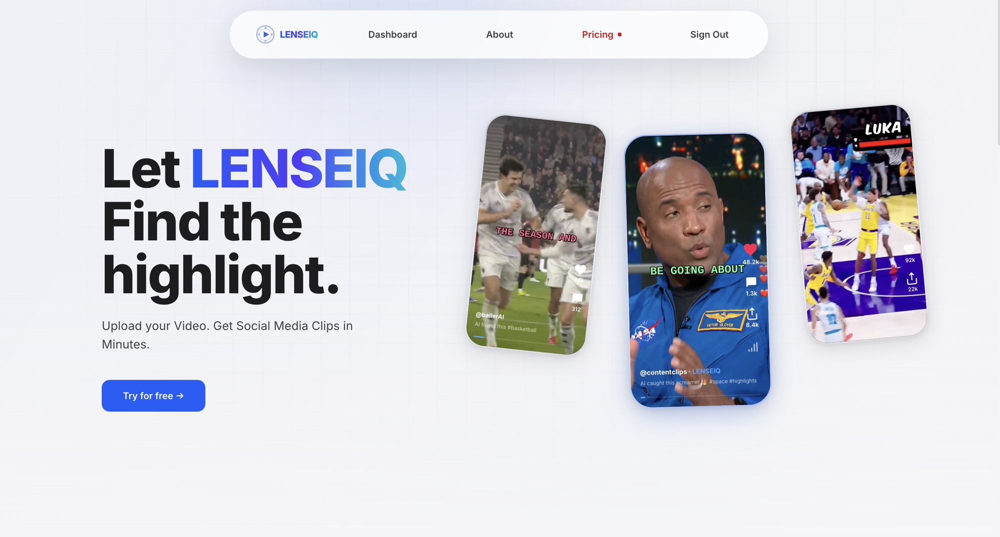
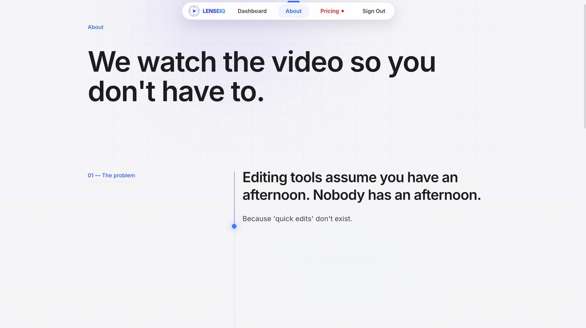

<div align="center">

# LENSEIQ

**Let LENSEIQ find the highlight.**

Upload a video. Get social media ready clips in minutes.

🔗 **Live at [lenseiq.vip](https://lenseiq.vip)**

</div>



---

Automatically detect and extract highlights from sports game footage using audio analysis, speech transcription, and keyword detection.

## What it does

LENSEIQ takes a long sports video (soccer, basketball, football, boxing, tennis) and automatically finds the moments worth clipping. It transcribes the commentary, scores every segment for excitement, cross references that with sudden spikes in crowd noise, then cuts, vertically crops, and captions the best moments into ready to post short form clips.

Editing tools assume you have an afternoon. Nobody has an afternoon. LENSEIQ watches the video so you don't have to.



## How it works

The pipeline runs in five stages:

1. **Ingestion** — the uploaded video is probed for duration and split into overlapping chunks.
2. **Transcription + acoustic analysis** — a dedicated **Go** microservice fans out one **goroutine** per chunk and transcribes them in parallel through the **Deepgram** (nova-2) API, while **Librosa** detects crowd noise spikes from the raw audio at the same time.
3. **Highlight scoring** — every transcript segment is scored against a sport specific keyword config (goals, dunks, knockouts, etc.), discounted if it sounds like a recap, boosted if it sounds like a live reaction, and fused with the acoustic spike data.
4. **Clip generation** — overlapping detections of the same moment are deduplicated, a reel budget is applied based on video length, and the winning highlights are cut and cropped to vertical 9:16.
5. **Caption burning** — word level, TikTok-style captions are generated from Deepgram's per-word timestamps and burned into each clip, revealing word-by-word and clearing during silence.

## Why it's built this way

- **~5× faster transcription.** The chunk transcription stage was rewritten from a Python `ThreadPoolExecutor` (bottlenecked by the GIL) into a **Go** service that fans out goroutines and merges results over channels — true parallel FFmpeg extraction + cloud STT, measured at **35s → 6s** on a 15-minute clip.
- **Word-accurate captions.** Real per-word timestamps from Deepgram drive progressive captions that stay in sync and disappear when no one is talking.
- **Runs in production.** Containerized with Docker Compose behind an Nginx reverse proxy with automatic Let's Encrypt TLS.

## Tech stack

**Transcription service:** Go (goroutines + channels), Deepgram nova-2

**Backend:** FastAPI, FFmpeg, librosa, NumPy/SciPy, PostgreSQL, JWT auth, SSE

**Frontend:** Next.js, React, Tailwind, Framer Motion, Google OAuth

**Infra:** Docker, Docker Compose, Nginx, Let's Encrypt, Google Cloud, GitHub Actions CI

## Run it locally

The easiest way to run LENSEIQ — no need to install Python, Node.js, Go, or FFmpeg directly. You only need [Docker Desktop](https://www.docker.com/products/docker-desktop/).

```bash
git clone https://github.com/ChrisAlexz/LenseIQ.git
cd LenseIQ

# create your env file and fill in the secrets
cp .env.production.example .env   # edit: DB password, Deepgram + Gemini keys, SMTP

docker compose up --build
```

- Frontend → http://localhost:3001
- Backend API → http://localhost:8001

You'll need a free [Deepgram](https://console.deepgram.com) API key ($200 free credit) and a [Gemini](https://aistudio.google.com/apikey) API key.

## Deployment

Production deploy guides (Docker Compose + Nginx + HTTPS) are included:

- [`DEPLOY_GCP.md`](DEPLOY_GCP.md) — Google Cloud (used for the live site)
- [`DEPLOY_ORACLE.md`](DEPLOY_ORACLE.md) — Oracle Cloud Always Free (ARM)
- [`DEPLOY.md`](DEPLOY.md) — AWS EC2

## API Endpoints

| Method | Endpoint                | Description                                     |
| ------ | ------------------------ | ------------------------------------------------ |
| GET    | `/`                      | Health check                                     |
| POST   | `/api/upload`            | Upload video (multipart form: `file` + `sport`)  |
| POST   | `/api/process/{job_id}`  | Run pipeline on uploaded video                   |
| GET    | `/api/status/{job_id}`   | Check processing status & get results            |

## Project structure

```
backend/
  cmd/transcriber/                 # Go: concurrent chunked Deepgram transcription
  transcription/                   # Python wrapper that calls the Go binary
  audio/extract_audio.py           # ffmpeg audio extraction
  acoustic/spike_detection.py      # audio volume spike detection
  linguistic/keyword_detection.py  # keyword scoring + spike fusion
  caption/                         # TikTok-style caption generation + burn-in
  video/clip_generator.py          # ffmpeg clip generation (9:16)
  configs/soccer_config.json       # sport-specific keyword weights
  llm/highlight_selector.py        # Gemini highlight selection (Pro)
  server.py                        # FastAPI server (main entry point)
frontend/                          # Next.js app
nginx/                             # reverse proxy config
docker-compose.prod.yml            # production stack (nginx + TLS)
```

## Supported Sports

Soccer, basketball, football, boxing, and tennis, each with its own keyword weighting config under `backend/configs/`. Adding a new sport is just a new JSON file mapping commentary keywords to excitement scores.

## CI/CD

Every push to `main` runs the GitHub Actions pipeline: backend import checks, frontend build, and on success, Docker images for both services are built and pushed to Docker Hub.

---

<div align="center">
<sub>Built for creators who don't have an afternoon to spare.</sub>
</div>
